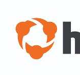
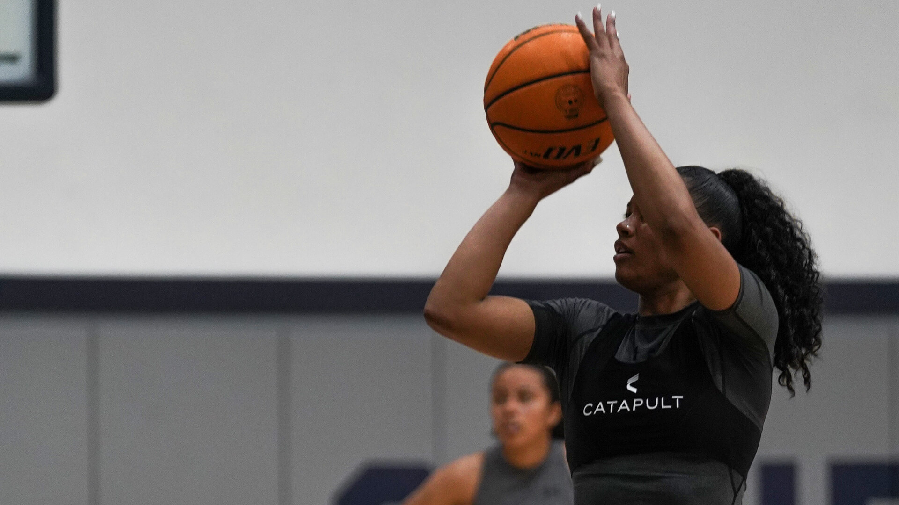
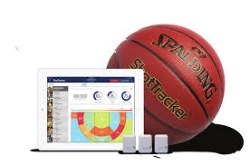
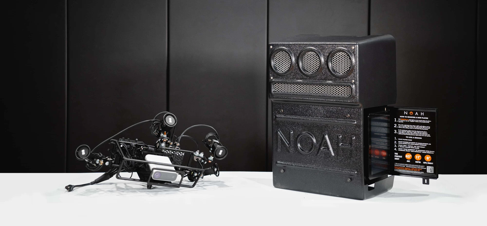

# AI Case Study: ShotQuality's AI Models Impact In The Game of Basketball

## Table Of Contents
[Overview and Origin](https://github.com/ncmoliver/ai-case-study?tab=readme-ov-file#overview-and-origin)   

[Business Activities](https://github.com/ncmoliver/ai-case-study?tab=readme-ov-file#business-activities)    

[Landscape](https://github.com/ncmoliver/ai-case-study?tab=readme-ov-file#landscape)    

[Results](https://github.com/ncmoliver/ai-case-study?tab=readme-ov-file#results)    

[Recommendations](https://github.com/ncmoliver/ai-case-study?tab=readme-ov-file#recommendations)    

## Overview and Origin

**When was the company incorporated?**    

ShotQuality was founded in 2020. 

**Who are the founders of the company?**    

Simon Gerszberg.    

**How did the idea for the company (or project) come about?**     

Gerszberg worked as a data analyst for Colgate University Men's Basketball Program.    

**How is the company funded? How much funding have they received?**    

The company received seed money from Investors. 

## Business Activities

**What specific problem is the company or project trying to solve?**    

The specific problem ShotQuality is looking to solve is to help teams win more games, by using an algorithm based software that predicts the outcome of a shot.

**Who is the company's intended customer? Is there any information about the market size of this set of customers?**     

The companies intended customer are basketball teams. Currently there are 3 main leagues, NBA, College, and High School that track stats. Below are a list of the top 2, NBA and Colleges with basketball programs, which show a clear picture of the market size.     

| League          | # of teams |   
| ------------    | ---------- |
| NBA             | 30 teams   |
| College - D1    | 351 teams  |
| College - D2    | 304 teams  |
| College - D3    | 420 teams  |
| College - NAIA  | 213 teams  |
| College - Junior| > 522 teams|
    

**What solution does this company offer that their competitors do not or cannot offer? What is the unfair advantage they utilize?**    

Solutions that this company offers that no other competitors offer is the direct focus on building a product that is designed to win. Every other competitors product tracks progress, provides visuals (as does ShotQuality), however it is provided to the coaches in a manner of a statistic. ShotQuality's software has created an algorithm with over 90 different variables involved (designed to alleviate biases) and is designed to provide statistics, daily updates, comparisons, game to game matchups and scouting reports that highlights the key factors that go into winning or losing each game. 

**Which technologies are they currently using, and how are they implementing them? (This may take a little bit of sleuthing&mdash;you may want to search the company’s engineering blog or use sites like Stackshare to find this information.)**    

ShotQuality used AI technologies within an algorithm based software that is based on 90 different variables. Based on a podcast, Gerszerb breaks down some of the main factors that goes into the algorithm:
* Shot Making Ability: A player natural ability to shoot the type of shot they are taking. 
* Type Of Shot: A catch and shoot shot naturally has a higher probability of going in than a shot off the dribble. A more drastic example, a layup has a higher probability of scoring than a 3 pointer. 
* Contested/Open: A player that has spaces and time to shoot the basketball, has more access to the muscle memory that they use to naturally shoot. Contested shots have the ability to rush, confine, or limit a players natural movement.

*Implementation*    

To train the model, Gerszerb spoke about the baseline he gave to the model which was statistics on the 50th percentile, comparing the difference between the worst and best statistic for each factor. From that baseline, he adjust the result based on player ability to make the specific type of shot taken.

## Landscape

**What field is the company in?**      
   
ShotQuality could be considered in a number of industries from spectator sports, but it is better to niche down to classify them in the sports analytics field. 

**What have been the major trends and innovations of this field over the last 5&ndash;10 years?**     
* Most Viewed
    * In the USA: ***football, basketball, and baseball*** are the most viewed sports.    
    * Internationally: ***soccer and cricket*** attract the most number of international fans. 
* Engagement
    * In 2023, the Fifa World Cup Qatar had around 5 billion people engaging over social media. 
* Expanding Markets
    * F1 race attendance increased to attracting a total of 5.7 million fans last year.   

**What are the other major companies in this field?**    

### Major Sports Analytic Companies  
#### 1. [Stats Perform](https://www.statsperform.com/)    
    
    
A sports AI company that combines statistics with performance to enhance decision making in player/team performance, digital media, and broadcasting and betting. 
***
#### 2. [Hudl](https://www.hudl.com/)    
    
Provides cost effective solutions for watching, sharing, and learning from film. They market to all leagues from professional down to amateur. 
***
### Major Basketball Analytic Companies
#### 1. [Catapult Sports](https://www.catapult.com/sports/basketball)
  
    
A sports wearable company that tracks player performance, body metrics, and provide video feedback and insight based on player tracking.  
***
#### 2. [ShotTracker](https://shottracker.com/)

ShotTracker is a company that uses 3 components to track player decisions, to providea plethora of different information for example, instant stats, player location (included labeled on-screen), live real-time reporting.    

The 3 components used by ShotTracker are the following:
- ShotTracker Enabled Basketball
- Anchors (located in the rafters)
- Player Sensors
***
### 3. [Noah Basketball](https://shottracker.com/)

A device that is installed on the backboard to gauge, track, and provide live feedback to player to enhance shooting.
## Results
**What has been the business impact of this company so far?**    
    
In there second season, ShotQuality has partnered with more than 60 NCAA teams.    

**What are some of the core metrics that companies in this field use to measure success? How is your company performing based on these metrics?**    
    
The primary metric ShotQuality is using to gauge success is wins and losses. Ultimately, we know coaches want to win basketball games. Providing them with metrics that pinpoint factors around your teams chances of winning and losing, through the algorithmics software that ultimately predicts a made or missed shot taking into account more than 90 different variables. 
> Teams who have signed up with ShotQuality win on average three more games than teams who have not signed up.

**How is your company performing relative to competitors in the same field?**    
    
ShotQuality is performing fairly well to say that they are niche down into the basketball arena. Companies like Stat Perform and Catapult Sports also use their products and software for other sports.    

For companies niche down specifically to basketball like ShotTracker and Noah Baksketball, I believe they all have different ways of going about things.     

For example, ***Noah Basketball*** focuses specifically on player development, tracking basketball shooting metrics. 
***ShotTracker*** is one of the leading basketball analytical companies, as it was founded in 2013. ShotQuality compared to ShotTracker is a bit unfair at the moment as ShotQuality is only two years old. Within those two years, they have seen a huge growth in success, funding, and subscriptions. 
## Recommendations

**If you were to advise the company, what products or services would you suggest they offer? (This could be something that a competitor offers, or use your imagination!)**    
Additional products and services that ShotQuality could offer are a visual predictions of player and team movements, training their ai model on common patterns and movmeents player make that correlate with the team system.    
In doing so, the software/model has enough factors to accurately gauge and possibly predict future player action based on player past patterns, movements, and actions faced with a similar situation.
For example, just looking at a common offensive tool like a pick & roll. Understanding there are 4 definitive ways to guard the pick and roll, identifying all other movements as a defensive malfunction. The three ways are to switch on the screen, hedge, get through, or ice the screen. The software should be able to identify how the screen was played defensively and how the offensive reacted to the defenses measures.   
Understand that the defense dictats all offensivive actions, is a key factor that you want to build the model off of. 

**Why do you think that offering this product or service would benefit the company?**       
Offering a product/service that could visually show the different possibilities of future movement would be next level in the game of basketball. Coaches with this insight, could now plan around predicted roadblocks that may.    

**What technologies would this additional product or service utilize?**     

*Software Update*: The software will need to be updated to produce a video version of the calculated product of the algorithm. Software will need to be designed to visually display metrics and factors that are being collected and analyzed by video software to create a animated version of a similated practice or game. The software will be able to track and recreate patters, plays, and movements. 

**Why are these technologies appropriate for your solution?**    
   
These technologies are appropiate for my solution because currently there are already products on the market that uses AI technologies to analyze video footage. With this, ShotQuality could create a similar product to add into thier existing algorithm in order to provide the additional metrics they will need in order to track and provide a visual representation on future action/movements. 