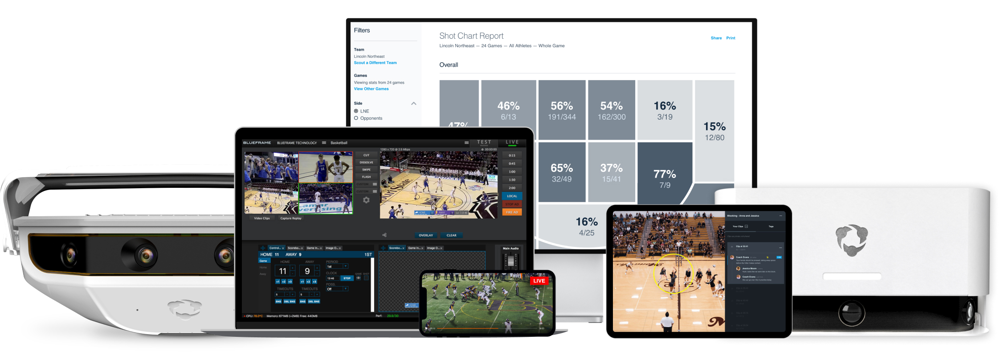

# ShotQuality's AI Models Impact In The Game of Basketball

## Table Of Contents
[Overview and Origin](https://github.com/ncmoliver/ai-case-study?tab=readme-ov-file#overview-and-origin)   

[Business Activities](https://github.com/ncmoliver/ai-case-study?tab=readme-ov-file#business-activities)    

[Landscape](https://github.com/ncmoliver/ai-case-study/blob/main/README.md#landscape)    

[Results](https://github.com/ncmoliver/ai-case-study?tab=readme-ov-file#results)    

[Recommendations](https://github.com/ncmoliver/ai-case-study?tab=readme-ov-file#recommendations)    

## Overview and Origin
ShotQuality is a basketball analytics company that combines that usage of "court vision technology and  AI to generate player location data", with the goal of predicting shot probability or expected result, to help teams win more games. The company was founded in 2020 by Simon Gerszberg.Gerszberg worked as a data analyst for Colgate University Men's Basketball Program. Two known investors that support ShotQuality are CTC Venture Capitalist and TIA Ventures.  The AI model is based on 5 key factors:    

| Key Factor      | Factor Description |   
| ------------    | ---------- |
| Defensive Distance | How defensive positioning and abilities impact the shot.|
| Shooter's Ability    | How good the shooter is.   |
| Play Type    | What type of action took place before the shot? (pick and roll, drive and kick)   |
| Shot Type| What happened during the shot? (off the dribble, catch and shoot, dunk.) |
| Key Inferences  | This is a factor they use as room to make up for missing data. (late shot clock, rushed, tall players.) |      
    

## Business Activities

**What specific problem is the company or project trying to solve?**    

The specific problem ShotQuality is looking to solve is to help teams win more games, by using an algorithm based software that predicts the outcome of a shot.

**Who is the company's intended customer? Is there any information about the market size of this set of customers?**     

The companies intended customer are basketball teams. Currently there are 3 main leagues, NBA, College, and High School that track stats. Below are a list of the top 2, NBA and Colleges with basketball programs, which show a clear picture of the market size.     

| League          | # of teams |   
| ------------    | ---------- |
| NBA             | 30 teams   |
| College - D1    | 351 teams  |
| College - D2    | 304 teams  |
| College - D3    | 420 teams  |
| College - NAIA  | 213 teams  |
| College - Junior| > 522 teams|
    

**What solution does this company offer that their competitors do not or cannot offer? What is the unfair advantage they utilize?**    

Solutions that this company offers that no other competitors offer is the direct focus on building a product that is designed to win. Every other competitors product tracks progress, provides visuals (as does ShotQuality), however it is provided to the coaches in a manner of a statistic. ShotQuality's software has created an algorithm with over 90 different variables involved (designed to alleviate biases) and is designed to provide statistics, daily updates, comparisons, game to game matchups and scouting reports that highlights the key factors that go into winning or losing each game. 

**Which technologies are they currently using, and how are they implementing them? (This may take a little bit of sleuthing&mdash;you may want to search the company’s engineering blog or use sites like Stackshare to find this information.)**    

ShotQuality used AI technologies within an algorithm based software that is based on 90 different variables. Based on a podcast, Gerszerb breaks down some of the main factors that goes into the algorithm:
* Shot Making Ability: A player natural ability to shoot the type of shot they are taking. 
* Type Of Shot: A catch and shoot shot naturally has a higher probability of going in than a shot off the dribble. A more drastic example, a layup has a higher probability of scoring than a 3 pointer. 
* Contested/Open: A player that has spaces and time to shoot the basketball, has more access to the muscle memory that they use to naturally shoot. Contested shots have the ability to rush, confine, or limit a players natural movement.

*Implementation*    

To train the model, Gerszerb spoke about the baseline he gave to the model which was statistics on the 50th percentile, comparing the difference between the worst and best statistic for each factor. From that baseline, he adjust the result based on player ability to make the specific type of shot taken.

## Landscape

**What field is the company in?**      
   
ShotQuality could be considered in a number of industries from spectator sports, but it is better to niche down to classify them in the sports analytics field. 

**What have been the major trends and innovations of this field over the last 5&ndash;10 years?**     
* Most Viewed
    * In the USA: ***football, basketball, and baseball*** are the most viewed sports.    
    * Internationally: ***soccer and cricket*** attract the most number of international fans. 
* Engagement
    * In 2023, the Fifa World Cup Qatar had around 5 billion people engaging over social media. 
* Expanding Markets
    * F1 race attendance increased to attracting a total of 5.7 million fans last year.   

**What are the other major companies in this field?**    

### Major Sports Analytic Companies  
#### 1. [Stats Perform](https://www.statsperform.com/)    

    
A sports AI company that combines statistics with performance to enhance decision making in player/team performance, digital media, and broadcasting and betting. 
***
#### 2. [Hudl](https://www.hudl.com/)    

Provides cost effective solutions for watching, sharing, and learning from film. They market to all leagues from professional down to amateur. 
***
### Major Basketball Analytic Companies
#### 1. [Catapult Sports](https://www.catapult.com/sports/basketball)

   
A sports wearable company that tracks player performance, body metrics, and provide video feedback and insight based on player tracking.  
***
#### 2. [ShotTracker](https://shottracker.com/)

ShotTracker is a company that uses 3 components to track player decisions, to providea plethora of different information for example, instant stats, player location (included labeled on-screen), live real-time reporting.    

The 3 components used by ShotTracker are the following:
- ShotTracker Enabled Basketball
- Anchors (located in the rafters)
- Player Sensors
***
### 3. [Noah Basketball](https://shottracker.com/)

A device that is installed on the backboard to gauge, track, and provide live feedback to player to enhance shooting.
***
## Results
**What has been the business impact of this company so far?**    
    
In there second season, ShotQuality has partnered with more than 60 NCAA teams.    

**What are some of the core metrics that companies in this field use to measure success? How is your company performing based on these metrics?**    
    
The primary metric ShotQuality is using to gauge success is wins and losses. Ultimately, we know coaches want to win basketball games. Providing them with metrics that pinpoint factors around your teams chances of winning and losing, through the algorithmics software that ultimately predicts a made or missed shot taking into account more than 90 different variables. 
> Teams who have signed up with ShotQuality win on average three more games than teams who have not signed up.

**How is your company performing relative to competitors in the same field?**    
    
ShotQuality is performing fairly well to say that they are niche down into the basketball arena. Companies like Stat Perform and Catapult Sports also use their products and software for other sports.    

For companies niche down specifically to basketball like ShotTracker and Noah Baksketball, I believe they all have different ways of going about things.     

For example, ***Noah Basketball*** focuses specifically on player development, tracking basketball shooting metrics. 
***ShotTracker*** is one of the leading basketball analytical companies, as it was founded in 2013. ShotQuality compared to ShotTracker is a bit unfair at the moment as ShotQuality is only two years old. Within those two years, they have seen a huge growth in success, funding, and subscriptions. 
## Recommendations

**If you were to advise the company, what products or services would you suggest they offer? (This could be something that a competitor offers, or use your imagination!)**    

Additional products and services that ShotQuality could offer are a visual predictions of player and team movements, training their ai model on common patterns and movmeents player make that correlate with the team system.    

In doing so, the software/model has enough factors to accurately gauge and possibly predict future player action based on player past patterns, movements, and actions faced with a similar situation.    

For example, just looking at a common offensive tool like a pick & roll. Understanding there are 4 definitive ways to guard the pick and roll, identifying all other movements as a defensive malfunction. The three ways are to switch on the screen, hedge, get through, or ice the screen. The software should be able to identify how the screen was played defensively and how the offensive reacted to the defenses measures.   
Understand that the defense dictats all offensivive actions, is a key factor that you want to build the model off of. 

**Why do you think that offering this product or service would benefit the company?**    

***3D Predictive Training & Game Simulations***    

Offering a product/service that is programmed to visually show the different possible outcomes of future player movement would be next level in the game of basketball for a company like ShotQuality. They have already built a AI model that uses different variables in basketball in order to predict the chances of every shot. However, train the model on past player actions, patterns, and behavior in order to predict future decisions would be next level.    
    
As we know basketball has a natural flow that must occur, when one team does not have the ball, other team has the basketball. If a team is not on offense they are on defense. When the basketball is in play it is in either 1 of four different parts of the game, which are dictated by the way the defense attempts to guard the basketball. The fours parts are Set, Transiton, Zone, or Press. This proves that there are set variables in the forever changing game of basketabll.     
ShotQuality goal is to help teams win games by taking into account more information on what they have done in the past to find success in similar situations. Win/Loss or indifferent, after the game coaches will have an opportunity to recreate the exact game situations, whether it was the last play of the game or a critical possession. They can now put their player, hopefully eventually their team back in the situation. With simulated but accurately movements, sized defenders, defensive rotations (reactions to the basketball). 
    
Also with this new technology, it gives a new meaning to player development. It has the potential to recreate game situations, to put a player back in the same situation he ran away from, did not face, or simply did not do well on. Instead of waiting for the situation to randomly appear again, the player will have many more reps to master the skill, fear, or level they are looking to accomplish.
***  
***Practice & Game Simulators***      

The company has a great service that they provide to their customers currently. Offering a 3d visual of predicted outcomes pairs well with the companies goals of helping teams win games.    

By understanding possible outcomes and adding them into the game plan, provides a different level of an competitive advantage.     

The plethora of different avenues that can be taken from the advancement of the software could build a product that could change the industry forever. Building a AI model to predict the non-predictive, constant adjusting game of basketball, with the constant variables,  patterns of player habits and movements, guided around the fundamental patterns and movements in the game.  
  
The hardest task to accomplish in player and team development is mentally putting the player/team back in specific game situations. Allow them to reexpereince not only what happened on the occassion to slow the moment down and truly allow players to reexperience full speed game momemnts in a live simulation. 

**What technologies would this additional product or service utilize?**     

*Software Update*: The software will need to be updated to produce a video version of the calculated product of the algorithm. Software will need to be designed to visually display metrics and factors that are being collected and analyzed by video software to create a animated version of a similated practice or game. The software will be able to track and recreate patters, plays, and movements. 

**Why are these technologies appropriate for your solution?**    

These technologies are appropiate for my solution because currently there are already products on the market that uses AI technologies to analyze video footage. With this, ShotQuality could use natural player inputs(to represent size, weight, and the natural stature of the player) and train the model on the fundamental player movements in the four different parts of the game to create a baseline. From that point, using the most appropiate variables AI should be able to create physical representation of each player invovled and predict the future movement based on their past movements in those situations. For example, if we have an entire season of data on every player on the team. To analyze an offense, the first thing we nee to do is to differentiate whether the team is running a play or not. The model will be designed to track the movement of player to first identify if they are running a play, next to track the patterns of the play, it should be able to identify player movements like  cuts, screens, post ups, passes, shots, and dribble moves. The benefit is that the defense it limiting the offender, which confines them to certain movements, reaction, and pattern in the way that they take in order to get around or score the basketball.    

The fundamentals of basketball gives way to AI because there is a right/wrong way of doing things. This provides a clear measure of instruction, correction, and a visible way of experiencing the game in a training environment. 

# References
* ShotQuality was founded in 2020 by Simon Gerszberg, a former student manager for Colgate's men's basketball team ("ShotQuality Raises Seed Round," Sports Business Journal, October 5, 2022). Retrieved from [Sports Business Journal](https://www.sportsbusinessjournal.com/Daily/Issues/2022/10/05/Technology/shotquality-basketball-analytics-seed-round.aspx#:~:text=ShotQuality%20was%20founded%20in%202020,for%20Colgate's%20men's%20basketball%20team).     
* Coaches that have subscribed to ShotQuality on average win more than 3 games a year compared to teams that have not signed up (Gerszberg, Simon. "ShotQuality.com," YouTube, November 25, 2020). Retrieved from [YouTube](https://www.youtube.com/watch?v=rBd9FbnrogI).     
* There are 351 Division I schools (NCSA College Recruiting. "Division 1 Men’s Basketball Colleges," NCSA Sports). Retrieved from [NCSA Sports](https://www.ncsasports.org/mens-basketball/division-1-colleges).    
* A map of all 30 NBA teams (Atlist. "NBA Team Map - All 30 Teams on a Map"). Retrieved from [Atlist](https://www.atlist.com/showcase/nba-team-map-all-30-teams-on-a-map#:~:text=About%20The%20NBA&text=The%20league%20is%20composed%20of,22%20states%20and%20one%20province).    
* There are 213 NAIA schools (NCSA College Recruiting. "NAIA Men’s Basketball Colleges," NCSA Sports). Retrieved from [NCSA Sports](https://www.ncsasports.org/mens-basketball/naia-colleges).    
* The number of D1, D2, and D3 schools (NCSA College Recruiting. "Men’s Basketball Colleges," NCSA Sports). Retrieved from [NCSA Sports](https://www.ncsasports.org/mens-basketball/colleges).    
* Shot making ability is discussed by Simon Gerszberg on ShotQuality.com (Gerszberg, Simon. "Simon Gerszberg - ShotQuality.com," Apple Podcasts). Retrieved from [Apple Podcasts](https://podcasts.apple.com/us/podcast/simon-gerszberg-shotquality-com/id1228435713?i=1000500070228).    
* The sports analytics market overview, including Texas A&M's agreement with Gemini Sports Analytics and the market shares of various segments ("Sports Analytics Market Size, Share & Trends Analysis Report," Grand View Research). Retrieved from [Grand View Research](https://www.grandviewresearch.com/industry-analysis/sports-analytics-market).    
* An overview of ShotTracker's focus and offerings ("ShotTracker," CB Insights). Retrieved from [CB Insights](https://www.cbinsights.com/company/shottracker).     
* How ShotTracker works, detailing its three components: basketball, wearable, and anchors ("How It Works," ShotTracker). Retrieved from [ShotTracker](https://shottracker.com/howitworks).
* Insights on the sports analytics market, including its impact on sports betting and media organizations ("Spectator Sports Market - Growth, Trends, and Forecasts," Mordor Intelligence). Retrieved from [Mordor Intelligence](https://www.mordorintelligence.com/industry-reports/spectator-sports-market).
* Company information on funding [crunchbase](https://www.crunchbase.com/organization/shotquality)